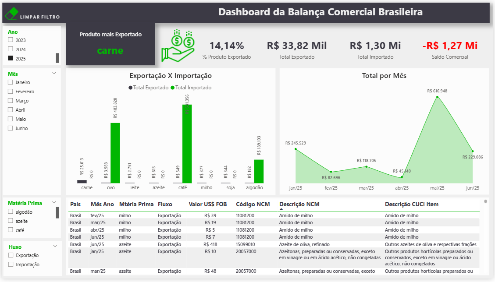

# 📊 Dashboard da Balança Comercial Brasileira

Projeto de **Análise de Dados e Visualização no Power BI** focado em explorar o desempenho da **Balança Comercial Brasileira**, analisando exportações, importações e saldo comercial ao longo do tempo.

Este projeto faz parte do meu **portfólio de projetos em análise de dados**, com foco em modelagem de dados, análise exploratória e construção de dashboards interativos.

---

# 🎯 Objetivo

Analisar o desempenho da **Balança Comercial do Brasil**, destacando indicadores importantes como:

- Exportações
- Importações
- Saldo comercial
- Evolução ao longo do tempo
- Comparação entre produtos

O dashboard foi desenvolvido para **identificar padrões, tendências e possíveis desequilíbrios no comércio exterior brasileiro**.

---

# 🛠 Tecnologias e Ferramentas Utilizadas

- **Power BI**
- **DAX (Data Analysis Expressions)**
- **Modelagem de Dados**
- **Visualização de Dados**
- **Análise Exploratória de Dados**

---

# 📊 Análises Disponíveis no Dashboard

O painel permite explorar os dados por meio de filtros interativos e indicadores visuais, incluindo:

✔ Total de exportações  
✔ Total de importações  
✔ Saldo da balança comercial  
✔ Evolução mensal dos indicadores  
✔ Comparação entre exportação e importação por produto  
✔ Análise por período

---

# 📌 Principais Insights

Alguns padrões identificados na análise:

- 🥩 **Carne aparece como principal produto exportado** no período analisado  
- 📉 Importações de **café, milho e ovos** superam as exportações em determinados momentos  
- ⚖️ O saldo comercial apresenta **oscilações ao longo do tempo**  
- 📊 Comparativos entre exportação e importação ajudam a identificar **desequilíbrios comerciais**
- 📅 A evolução mensal entre **2018 e 2020** mostra variações sazonais no fluxo comercial

---

# 📷 Visual do Dashboard



---

# 📂 Estrutura do Projeto

```
powerbi-dash-balanca-comercial
│
├── data
│   └── Base de dados utilizada no projeto
│
├── dashboard
│   └── Arquivo Power BI (.pbix)
│
├── images
│   └── Prints do dashboard
│
└── README.md
```

---

# 🌐 Fonte dos Dados

A base de dados utilizada neste projeto foi originalmente obtida a partir do portal oficial **Comex Stat**, do Ministério do Desenvolvimento, Indústria, Comércio e Serviços (MDIC):

🔗 https://comexstat.mdic.gov.br/pt/geral

Para fins de **estudo e prática em análise de dados**, o conjunto de dados utilizado neste projeto foi **adaptado e simplificado**.

Parte dos dados foi **modificada e complementada com valores simulados**, criando um **dataset fictício baseado na estrutura dos dados reais**.

O objetivo dessa adaptação foi permitir o **treinamento de técnicas de modelagem de dados, análise e visualização no Power BI**.

⚠️ Portanto, os valores apresentados **não representam dados oficiais completos**, sendo utilizados exclusivamente para **fins educacionais e demonstração de análise de dados**.

---

# 👩‍💻 Autora

**Nayara Rocha Vasselechen**

Projeto desenvolvido como parte do meu **portfólio de Análise de Dados**, com foco em:

- SQL
- Power BI
- Modelagem de Dados
- Business Intelligence

